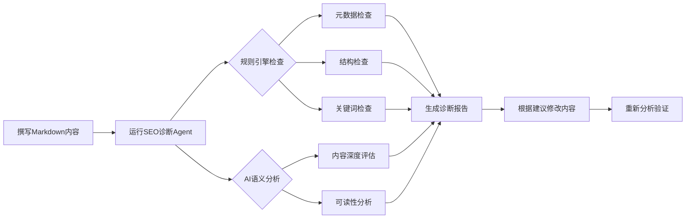

# 产品需求文档 (PRD)
# Markdown SEO 诊断 Agent

**文档版本**: v1.0
**创建日期**: 2025-11-27
**负责人**: Claude Code (PM)
**开发团队**: Codex

---

## 1. 项目背景与目标

### 1.1 背景
在现代内容营销中，Markdown已成为技术博客、文档站点、静态网站的主流格式。然而，现有的SEO工具主要针对HTML网页，缺乏对Markdown格式的原生支持。内容创作者需要手动将Markdown转换为HTML后才能进行SEO分析，效率低下。

### 1.2 目标
开发一个**基于Python的SEO智能体（Agent）**，专门用于审查Markdown格式的内容。该Agent不仅基于硬性规则（如标题长度、关键词密度）打分，还利用LLM进行深度语义分析，最终输出一份带有分数的诊断报告和可执行的优化建议。

### 1.3 核心价值主张
- **原生Markdown支持**: 无需转换，直接分析.md文件
- **双引擎分析**: 规则引擎（快速、准确）+ AI引擎（深度、智能）
- **可执行建议**: 提供具体的代码示例和修改建议，而非泛泛而谈
- **配置化规则**: 支持自定义SEO规则阈值，适应不同场景
- **Markdown报告**: 输出人类可读的Markdown格式报告，便于分享和存档

---

## 2. 用户场景与工作流

### 2.1 核心用户角色
- **技术博主**: 使用Markdown撰写技术文章，需要优化SEO以提升文章曝光
- **文档工程师**: 维护产品文档站（如GitBook、VuePress），需确保文档SEO友好
- **内容运营**: 管理静态博客（如Hugo、Jekyll），需批量检查内容质量

### 2.2 用户工作流



**步骤说明**:
1. 用户使用CLI命令分析Markdown文件：`python main.py analyze article.md --keyword "Python SEO"`
2. Agent解析Frontmatter（元数据）和正文内容
3. 规则引擎执行静态检查（Title长度、H1唯一性、图片Alt等）
4. AI引擎执行语义检查（内容质量、关键词相关性、可读性）
5. 系统计算加权总分（0-100分）
6. 输出Markdown格式的诊断报告，包含：
   - 总分和分项得分
   - 严重问题列表（Critical Issues）
   - 优化建议（Suggestions）
   - AI生成的具体改进方案
7. 用户根据报告修改内容，重新分析验证改进效果

---

## 3. 功能需求

### 3.1 数据解析层

#### FR-1.1: Frontmatter解析
**优先级**: P0（必需）
**描述**: 支持解析YAML格式的Frontmatter，提取元数据字段

**技术要求**:
- 使用 `python-frontmatter` 库
- 支持字段: `title`, `description`, `tags`, `keywords`, `slug`, `date`, `author`
- 容错处理: 缺失字段应返回空字符串，而非抛出异常

**验收标准**:
```yaml
---
title: "Markdown SEO最佳实践"
description: "深度解析Markdown内容的SEO优化技巧，提升搜索排名"
tags: [SEO, Markdown, 内容优化]
---
```
应成功解析为字典: `{"title": "Markdown SEO最佳实践", "description": "深度解析..."}`

#### FR-1.2: Markdown转HTML
**优先级**: P0（必需）
**描述**: 将Markdown正文转换为HTML DOM树，便于结构分析

**技术要求**:
- 使用 `markdown` 库，启用扩展: `['extra', 'codehilite', 'tables']`
- 使用 `BeautifulSoup` 解析HTML
- 保留原始Markdown中的标题层级、链接、图片等结构

**验收标准**:
```markdown
# 主标题

[链接文本](https://example.com)
```
应转换为可解析的HTML DOM，支持提取H1、img、a标签

#### FR-1.3: 关键词自动提取
**优先级**: P1（重要）
**描述**: 当用户未提供关键词时，自动从内容中提取Top关键词

**技术要求**:
- 参考 `/mnt/d/SEO_develop/SEO-AutoPilot/pyseoanalyzer/analyzer.py:16-94` 的 `is_quality_keyword()` 实现
- 提取单词、双词组、三词组（unigrams, bigrams, trigrams）
- 使用 `Counter` 统计词频
- 过滤低质量关键词（URL片段、HTML代码、停用词等）
- 计算关键词密度: `(关键词出现次数 / 总词数) * 100%`

**验收标准**:
- 对于1000词的文章，应提取出Top 10关键词
- 过滤掉 "http://", "www.", "class=", "<div>" 等技术术语
- 输出格式: `[{"keyword": "SEO工具", "count": 8, "density": 0.8}]`

---

### 3.2 评分维度与逻辑

系统采用**100分制加权评分**，分为4个维度：

| 维度 | 检查项ID | 检查内容 | 评分方式 | 权重 | 技术实现 |
|------|---------|----------|---------|------|----------|
| **元数据 (30分)** | | | | | |
| | `META_01` | Title存在性与长度 (30-60 chars) | 规则判断 | 15% | Python String |
| | `META_02` | Description存在性与长度 (120-160 chars) | 规则判断 | 15% | Python String |
| **结构 (25分)** | | | | | |
| | `STRUC_01` | 唯一H1标签检查 | 规则判断 | 10% | BeautifulSoup |
| | `STRUC_02` | 图片Alt属性覆盖率 | 规则判断 | 10% | BeautifulSoup |
| | `STRUC_03` | 内部/外部链接存在性 | 规则判断 | 5% | BeautifulSoup |
| **关键词 (20分)** | | | | | |
| | `KEY_01` | 关键词密度 (1% - 2.5%) | 规则判断 | 10% | Regex/Counter |
| | `KEY_02` | 关键词出现在Title/Desc/首段 | 规则判断 | 10% | String Match |
| **AI语义 (25分)** | | | | | |
| | `AI_01` | 内容深度与价值评分 | **LLM评分** | 15% | OpenAI API |
| | `AI_02` | 阅读流畅度 (Readability) | **LLM评分** | 10% | OpenAI API |

#### FR-2.1: 元数据检查 (META_*)
**优先级**: P0（必需）

**META_01: Title检查**
- 缺失Title: 0分，严重问题（Critical）
- Title < 30字符: 50%得分，高优先级警告（High）
- Title > 70字符: 50%得分，高优先级警告（High）
- 30 ≤ Title ≤ 60: 100%得分
- 参考实现: `/mnt/d/SEO_develop/SEO-AutoPilot/pyseoanalyzer/analyzer.py:653-672`

**META_02: Description检查**
- 缺失Description: 0分，高优先级警告（High）
- Description < 120字符: 30%得分，中优先级警告（Medium）
- Description > 160字符: 70%得分，中优先级警告（Medium）
- 120 ≤ Description ≤ 160: 100%得分
- 参考实现: `/mnt/d/SEO_develop/SEO-AutoPilot/pyseoanalyzer/analyzer.py:673-696`

#### FR-2.2: 结构检查 (STRUC_*)
**优先级**: P0（必需）

**STRUC_01: H1标签检查**
- 缺失H1: 0分，高优先级警告
- 多个H1: 50%得分，中优先级警告
- 唯一H1: 100%得分

**STRUC_02: 图片Alt属性检查**
- 计算Alt覆盖率: `(有alt的图片数 / 总图片数) * 100%`
- 覆盖率 < 50%: 0分，高优先级警告
- 50% ≤ 覆盖率 < 80%: 50%得分，中优先级警告
- 覆盖率 ≥ 80%: 100%得分

**STRUC_03: 链接存在性检查**
- 无任何链接: 0分，中优先级警告
- 有链接: 100%得分
- 额外检查: 区分内部链接和外部链接（信息性，不影响得分）

#### FR-2.3: 关键词检查 (KEY_*)
**优先级**: P1（重要）

**KEY_01: 关键词密度检查**
- 前提: 用户提供关键词，或自动提取到Top关键词
- 密度 < 1%: 30%得分，建议增加关键词
- 1% ≤ 密度 ≤ 2.5%: 100%得分
- 密度 > 2.5%: 50%得分，警告关键词堆砌（Keyword Stuffing）

**KEY_02: 关键词位置检查**
- 关键词出现在Title: +33%得分
- 关键词出现在Description: +33%得分
- 关键词出现在首段（前100词）: +34%得分
- 总分为三项之和（0-100%）

#### FR-2.4: AI语义分析 (AI_*)
**优先级**: P1（重要）

**AI_01: 内容深度与价值**
- LLM评估内容是否提供独特价值、深度分析、实用案例
- 评分范围: 0-10分，映射到0-15分（权重15%）
- Prompt示例:
  ```
  评估以下内容的深度和价值（0-10分）:
  - 是否提供独特见解？
  - 是否有具体案例或数据支持？
  - 是否深入分析问题而非浅尝辄止？

  内容: {content[:2000]}
  ```

**AI_02: 阅读流畅度**
- LLM评估段落结构、句子长度、逻辑连贯性
- 评分范围: 0-10分，映射到0-10分（权重10%）
- Prompt示例:
  ```
  评估以下内容的可读性（0-10分）:
  - 段落是否清晰简洁？
  - 句子长度是否适中？
  - 逻辑是否连贯？

  内容: {content[:2000]}
  ```

---

### 3.3 输出报告

#### FR-3.1: Markdown格式报告
**优先级**: P0（必需）

**报告结构**:
```markdown
# 📝 SEO诊断报告

**文件**: {file_path}
**分析时间**: {timestamp}
**总分**: {total_score}/100 {emoji_badge}

## 📊 评分详情

| 维度 | 得分 | 权重 | 状态 |
|------|------|------|------|
| 元数据 | XX/30 | 30% | 🔴/🟠/🟡/🟢 |
| 结构 | XX/25 | 25% | 🔴/🟠/🟡/🟢 |
| 关键词 | XX/20 | 20% | 🔴/🟠/🟡/🟢 |
| AI语义 | XX/25 | 25% | 🔴/🟠/🟡/🟢 |

---

## 🔴 严重问题 (Critical)

### META_01: Title缺失
- **严重程度**: Critical
- **当前状态**: Frontmatter中未定义title字段
- **影响**: 搜索引擎无法识别页面主题，严重影响排名
- **修复建议**:
  \```yaml
  ---
  title: "你的页面标题（30-60字符）"
  ---
  \```

## 🟠 高优先级警告 (High)

{high_priority_issues}

## 🟡 中优先级建议 (Medium)

{medium_priority_issues}

## 💡 AI优化建议

### 内容深度分析 (X.X/10)
{ai_content_analysis}

### 可读性分析 (X.X/10)
{ai_readability_analysis}

## 📝 快速修复清单

- [ ] {issue_1}
- [ ] {issue_2}
- [ ] {issue_3}
```

**Emoji严重程度标记**:
- 🔴 **Critical** (0-40分): 必须立即修复
- 🟠 **High** (41-60分): 高优先级，显著影响SEO
- 🟡 **Medium** (61-80分): 中优先级，有优化空间
- 🟢 **Low** (81-100分): 良好，仅需微调

#### FR-3.2: 具体可执行建议
**优先级**: P0（必需）

每个问题应包含:
1. **当前状态**: 显示实际检测到的内容
2. **建议值**: 提供具体的优化目标
3. **修复示例**: 提供可直接使用的代码示例
4. **影响说明**: 解释为什么这个问题重要

**示例**:
```markdown
### META_02: Description过短
- **当前长度**: 85字符
- **建议长度**: 120-160字符
- **当前内容**: "这是一个简单的描述"
- **优化示例**:
  \```yaml
  description: "这是一个专业的Markdown SEO诊断工具，基于AI和规则引擎，自动分析页面的元数据、结构、关键词和语义质量，提供详细的优化建议。（150字符）"
  \```
- **为什么重要**: Description是搜索结果中的摘要文本，过短会影响点击率
```

---

## 4. 非功能需求

### 4.1 性能要求
- 单文件分析时间: < 5秒（不含LLM调用）
- LLM调用超时: 30秒
- 支持文件大小: < 1MB（约50,000词）

### 4.2 可用性要求
- CLI命令简洁直观: `python main.py analyze <file> [--keyword <kw>]`
- 错误提示清晰: 当文件不存在、格式错误时，给出明确的错误信息
- 进度反馈: 分析过程中显示进度（可选，使用rich库）

### 4.3 可扩展性要求
- 配置化规则: 所有阈值应可通过配置文件调整
- 环境变量支持: `SEO_RULES_CONFIG` 可覆盖配置路径
- LLM Provider抽象: 预留接口支持未来切换到其他LLM（如Claude）

### 4.4 容错性要求
- LLM调用失败时降级: 当API调用失败时，仍输出基于规则引擎的报告
- 3次重试机制: LLM调用失败后自动重试3次
- 详细错误日志: 记录所有异常到日志文件

---

## 5. 技术栈

### 5.1 核心依赖
```txt
python-frontmatter>=1.0.0   # Frontmatter解析
beautifulsoup4>=4.12.0      # HTML解析
markdown>=3.5.0             # Markdown → HTML
pydantic>=2.5.0             # 数据模型和验证
openai>=1.6.0               # OpenAI API
rich>=13.0.0                # CLI美化（可选）
```

### 5.2 LLM API配置
- **提供商**: OpenAI（通过中转服务）
- **API地址**: `https://newapi.deepwisdom.ai/v1`
- **模型**: `gpt-4o`
- **API密钥**: 通过环境变量 `OPENAI_API_KEY` 配置
  - 默认值: `sk-tVlvoM4GZwWVT7GQWWcU8aD7J0pGguWBGiPFd6l4uF4JVMRM`

### 5.3 参考项目
从 `/mnt/d/SEO_develop/SEO-AutoPilot/pyseoanalyzer` 项目借鉴：
- 配置系统设计: `seo_rules_config.py`
- 关键词提取逻辑: `analyzer.py:16-94`
- Title/Description检查: `analyzer.py:653-696`
- 数据模型设计: `page.py`

---

## 6. 成功指标

### 6.1 功能完整性
- ✅ 支持解析Frontmatter和Markdown正文
- ✅ 实现4个维度的评分系统
- ✅ 集成LLM语义分析
- ✅ 输出Markdown格式报告
- ✅ 提供可执行的优化建议

### 6.2 质量指标
- 评分准确性: 与手动SEO审查的一致性 > 80%
- AI建议有效性: 用户采纳率 > 60%
- 报告可读性: 用户理解成本 < 5分钟

### 6.3 性能指标
- 分析速度: 1000词文章 < 3秒（不含LLM）
- LLM响应: 平均响应时间 < 5秒
- 错误率: LLM调用失败率 < 5%

---

## 7. 里程碑与交付物

### Phase 1: MVP核心功能（Week 1）
- [ ] Frontmatter和Markdown解析
- [ ] 规则引擎（元数据、结构、关键词检查）
- [ ] 基础报告生成（Markdown格式）
- **交付物**: 可运行的CLI工具，支持纯规则分析

### Phase 2: AI集成（Week 2）
- [ ] OpenAI API集成
- [ ] AI语义分析引擎
- [ ] AI建议生成
- **交付物**: 完整的双引擎分析系统

### Phase 3: 优化与测试（Week 3）
- [ ] 配置化规则系统
- [ ] 错误处理和降级机制
- [ ] 单元测试和集成测试
- **交付物**: 生产就绪的v1.0版本

---

## 8. 附录

### 8.1 Frontmatter示例
```yaml
---
title: "Markdown SEO最佳实践指南"
description: "深度解析Markdown内容的SEO优化技巧，涵盖元数据、结构、关键词和语义质量四大维度，提升搜索排名和内容曝光。"
tags: [SEO, Markdown, 内容优化, 搜索引擎]
keywords: "Markdown SEO, 内容优化, SEO工具"
author: "技术博主"
date: 2025-11-27
slug: "markdown-seo-best-practices"
---
```

### 8.2 诊断报告示例
详见 `/home/jason/.claude/plans/iridescent-plotting-lamport.md` 中的"输出报告示例"部分。

### 8.3 术语表
- **Frontmatter**: Markdown文件开头的YAML格式元数据
- **规则引擎**: 基于硬编码规则的静态检查系统
- **AI引擎**: 基于LLM的语义分析系统
- **关键词密度**: 关键词出现次数占总词数的百分比
- **评分权重**: 各维度在总分中的占比

---

**文档结束**

**下一步**: 请参考 `TECH_DESIGN.md` 查看技术架构设计，以及 `CODEX_PROMPT.md` 查看详细的开发指令。
